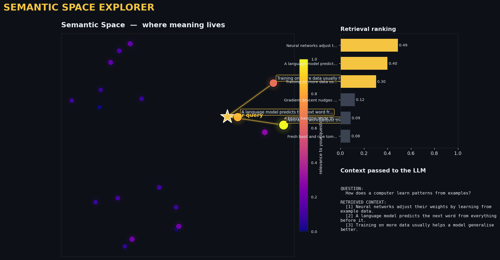

# Neural Canvas 🎨🧠

A small collection of **machine-learning projects built from first principles** —
no black boxes, everything visible and explained. Two demos so far:

1. **Digit recognizer** — a neural network written from scratch in pure NumPy.
2. **Semantic Space Explorer** — a beautiful visual demonstration of how RAG
   retrieval actually works.

---

## 1. Handwritten Digit Recognition — Neural Network from Scratch

A 2-layer neural network that recognizes handwritten digits (0–9), built in
**pure NumPy** — no TensorFlow, no PyTorch. Forward pass, cross-entropy loss,
backpropagation, and gradient descent are all hand-coded.

Trains in ~2 seconds on CPU and reaches **~97% accuracy** on unseen images.

```bash
python my.py
```

| Concept | Where |
|---|---|
| Forward pass (linear → ReLU → linear → softmax) | `NeuralNetwork.forward` |
| Cross-entropy loss | `cross_entropy` |
| Backpropagation (chain rule, by hand) | `NeuralNetwork.backward` |
| Mini-batch gradient descent | `main` training loop |

The dataset is scikit-learn's bundled 8×8 `digits` set, so nothing is
downloaded and it runs offline.

---

## 2. Semantic Space Explorer — RAG Retrieval, Visualized

RAG ("Retrieval-Augmented Generation") finds the documents closest in **meaning**
to your question. That meaning space is normally invisible — this makes it
**visible**. It embeds a library of sentences, flattens the high-dimensional
meaning space to 2D, and lights up the documents a question would retrieve.

```bash
python rag_visual.py
```



| Visual | Meaning |
|---|---|
| ⭐ Gold star | Your question, placed in the same meaning space |
| 🟡 Bright / large points | Documents most relevant to the question |
| 🟣 Dim / small points | Irrelevant documents |
| ✨ Glowing beams | The top matches RAG retrieves and feeds the LLM |
| 📊 Side bars | Ranked similarity scores |
| 📄 Bottom panel | The exact context the LLM would receive |

The example questions deliberately share almost **no words** with the documents
they match — proving this is *meaning-based* search, not keyword matching.
High-resolution images are saved to `visuals/` for every example query.

---

## Setup

```bash
pip install -r requirements.txt
```

- Python 3.9+
- numpy, scikit-learn, matplotlib, sentence-transformers

---

Built by [Muhammad Farooqi](https://github.com/mqfarooqi1).
